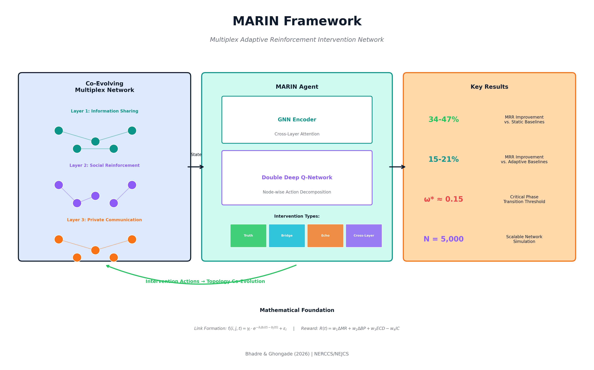

# MARIN Framework

**Multiplex Adaptive Reinforcement Intervention Network for Real-Time Misinformation Containment**

[](https://www.python.org/downloads/)
[](https://opensource.org/licenses/MIT)
[](https://orb.binghamton.edu/nejcs/)

## Overview

MARIN is a novel framework that combines **deep reinforcement learning** with **co-evolving multiplex networks** for adaptive misinformation intervention. Unlike traditional approaches that assume static network topologies, MARIN allows the network structure to evolve based on both misinformation dynamics and intervention actions.



## Key Features

- **Co-Evolving Multiplex Network Model**: Three-layer network (Information Sharing, Social Reinforcement, Private Communication) with dynamic topology
- **GNN-based State Encoding**: Graph Neural Network encoder with cross-layer attention aggregation
- **DDQN Agent**: Double Deep Q-Network for optimal intervention selection
- **Four Intervention Types**:
  1. Truth Injection
  2. Bridge-Node Activation
  3. Echo Chamber Disruption
  4. Cross-Layer Amplification
- **Phase Transition Analysis**: Identifies critical rewiring rate thresholds

## Key Results

| Metric | MARIN vs Static Baseline | MARIN vs Adaptive Baseline |
|--------|-------------------------|---------------------------|
| MRR Improvement (ω=0.2) | **+47%** | **+21%** |
| MRR Improvement (ω=0.05) | **+34%** | **+13%** |
| Critical Threshold | ω* ≈ 0.15 | - |

## Installation

```bash
# Clone the repository
git clone https://github.com/[YOUR-USERNAME]/MARIN-Framework.git
cd MARIN-Framework

# Create virtual environment
python -m venv marin_env
source marin_env/bin/activate  # On Windows: marin_env\Scripts\activate

# Install dependencies
pip install -r requirements.txt
```

## Requirements

- Python 3.8+
- PyTorch 1.12+
- NetworkX 3.2+
- Mesa 2.1+
- NumPy
- Pandas
- Matplotlib

## Quick Start

```python
from src.marin_network import MultiplexNetwork
from src.marin_agent import MARINAgent
from src.simulation import run_simulation

# Initialize network
network = MultiplexNetwork(n_nodes=1000, n_layers=3)

# Initialize MARIN agent
agent = MARINAgent(
    state_dim=128,
    n_intervention_types=4,
    budget=50
)

# Run simulation
results = run_simulation(
    network=network,
    agent=agent,
    n_episodes=2000,
    co_evolution_rate=0.1
)

print(f"Final MRR: {results['mrr']:.2f}%")
```

## Repository Structure

```
MARIN-Framework/
├── README.md                 # This file
├── LICENSE                   # MIT License
├── requirements.txt          # Python dependencies
├── src/
│   ├── __init__.py
│   ├── marin_network.py      # Multiplex network model
│   ├── marin_agent.py        # DDQN agent implementation
│   ├── gnn_encoder.py        # Graph Neural Network encoder
│   ├── belief_dynamics.py    # Agent belief update mechanisms
│   ├── interventions.py      # Intervention type implementations
│   └── simulation.py         # Monte Carlo simulation runner
├── configs/
│   ├── default_config.yaml   # Default hyperparameters
│   └── experiment_configs/   # Experiment-specific configs
├── data/
│   ├── synthetic/            # Generated synthetic networks
│   └── README.md             # Data documentation
├── results/
│   ├── figures/              # Generated figures
│   └── tables/               # Result tables
├── docs/
│   ├── graphical_abstract.png
│   └── equations.md          # Mathematical formulations
└── experiments/
    ├── run_baseline.py       # Baseline comparison experiments
    ├── run_ablation.py       # Ablation studies
    └── run_scalability.py    # Scalability analysis
```

## Hyperparameters

| Parameter | Value | Description |
|-----------|-------|-------------|
| N | 1,000-5,000 | Network size |
| ω | 0.01-0.5 | Co-evolution rate |
| λ | 0.5-5.0 | Homophily strength |
| μ | 0.1 | Belief update rate |
| κ | 1.5 | Confirmation bias parameter |
| γ | 0.99 | Discount factor |
| τ | 1,000 | Target network update frequency |

See `configs/default_config.yaml` for complete hyperparameter specification.

## Reproducibility

All experiments use random seeds 1-100 for reproducibility:

```python
import numpy as np
import torch
import random

def set_seed(seed):
    np.random.seed(seed)
    torch.manual_seed(seed)
    random.seed(seed)

# Run 100 Monte Carlo simulations
for seed in range(1, 101):
    set_seed(seed)
    results = run_simulation(...)
```

## Mathematical Formulation

### Link Formation (Equation 1)
```
f_l(i,j,t) = γ_l · exp(-λ_l · |b_i(t) - b_j(t)|) + ε_l
```

### Belief Update (Equation 4)
```
b_i(t+1) = (1-μ) · b_i(t) + μ · [κ · B_i(m,t) + (1-κ) · S_i(t)]
```

### Reward Function (Equation 9)
```
R(t) = w₁·ΔMR(t) + w₂·ΔBP(t) + w₃·ECD(t) - w₄·IC(t)
```

See `docs/equations.md` for complete mathematical formulations.

## Citation

If you use this code in your research, please cite:

```bibtex
@article{bhadre2026marin,
  title={Adaptive Intervention Strategies in Co-Evolving Multiplex Networks: 
         A Reinforcement Learning Approach to Real-Time Misinformation Containment},
  author={Bhadre, Anjali and Ghongade, Harshvardhan},
  journal={Northeast Journal of Complex Systems (NEJCS)},
  year={2026},
  publisher={Binghamton University}
}
```

## Related Work

This work builds upon our prior research:

- Ghongade, H. & Bhadre, A. (2026). "Multiplex Social Networks for Misinformation Control." *Northeast Journal of Complex Systems*, forthcoming.

## License

This project is licensed under the MIT License - see the [LICENSE](LICENSE) file for details.

## Contact

- **Anjali Bhadre** (Corresponding Author): anjalibhadre38@gmail.com
- **Harshvardhan Ghongade**: ghongade@gmail.com

## Acknowledgments

- G.H. Raisoni College of Engineering and Management, Pune
- Brahma Valley College of Engineering and Research Institute (SPPU), Nashik
- NERCCS 2026 Conference Committee
